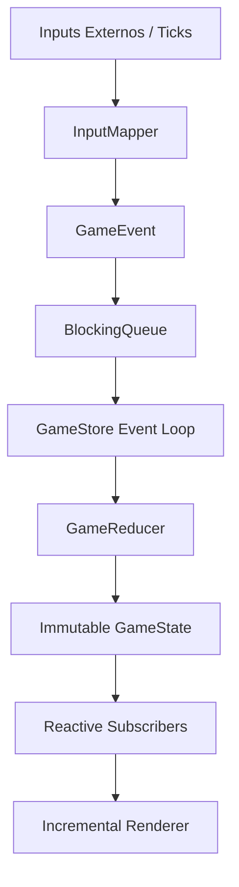

# 🕹️ Functional Tetris Engine

### Engine Reativa, Determinística e Funcional construída com Java 21 e JavaFX

 


O **Functional Tetris Engine** não foi desenvolvido como um simples clone de Tetris. Este projeto foi concebido como um laboratório arquitetural avançado para explorar aplicações práticas de programação funcional, arquiteturas orientadas a eventos e simulações determinísticas dentro do ecossistema Java moderno.

---

## 🚀 Objetivos de Engenharia

Este projeto funciona estritamente como um ambiente de experimentação de padrões de alta confiabilidade frequentemente encontrados em **trading engines financeiras**, **motores de simulação** e **sistemas distribuídos de baixa latência**:

- **Arquitetura Funcional:** Separação total entre lógica combinatória pura e efeitos colaterais de infraestrutura.
- **Simulação Determinística:** Capacidade de reproduzir exatamente qualquer execução a partir de uma linha temporal de eventos.
- **Imutabilidade Estrita:** Eliminação de mutação compartilhada, tratando o estado como uma sequência imutável de snapshots.
- **Event Sourcing & Reducers:** Estado da aplicação derivado exclusivamente da redução de uma fila ordenada de comandos.
- **Renderização Incremental:** Otimização de UI baseada no cálculo computacional de diferenças de matrizes.
- **Runtimes Auditáveis:** Extração de telemetria precisa e trilhas de execução para depuração sem efeitos colaterais.

---

## 📐 Filosofia Arquitetural

A maioria das implementações tradicionais de jogos baseados em grid segue um modelo imperativo: estado global mutável, timers manipulando entidades diretamente e lógica de domínio acoplada à camada de visualização. 

Este projeto adota a premissa inversa. Toda a engine orbita ao redor de uma **função matemática pura de transição de estado**:

$$\mathcal{f}(\text{Estado Atual}, \text{Evento}) \rightarrow \text{Novo Estado}$$

Formalmente descrita como:
```java
f(state, event) = nextState
```

Cada ação do jogo é um evento imutável. A aplicação não manipula diretamente o mundo; ela injeta comandos em um pipeline que passa por uma **serialização determinística das transições de estado**, garantindo transparência referencial e isolamento lógico do domínio.

---

## 🛠️ Conceitos Fundamentais Implementados

### 1. Estado Imutável
O estado global do jogo é modelado através de `records` Java imutáveis. Cada tick de tempo ou input gera um snapshot completamente novo, impedindo vazamento de escopo ou mutações inesperadas.

```java
public record GameState(
        Board board,
        Tetromino activePiece,
        List<Tetromino.Shape> nextQueue,
        long score,
        long linesCleared,
        GameStatus status,
        long seed,
        Optional<GameReducer.LineClearInfo> pendingClear
) {}
```

### 2. Modelagem Algébrica de Domínio (Java 21)
Uso exaustivo do sistema de tipos do Java para modelar ações através de `sealed interfaces` contendo *nested records*, garantindo consistência estrita com a implementação real do domínio:

```java
public sealed interface GameEvent {
    record MoveLeft() implements GameEvent {}
    record MoveRight() implements GameEvent {}
    record MoveDown() implements GameEvent {}
    record HardDrop() implements GameEvent {}
    record TimeTick() implements GameEvent {}
    record LineAnimationEnd() implements GameEvent {}
}
```

Isso viabiliza o uso de **Pattern Matching Exaustivo**, reduzindo estados inválidos e ramificações não tratadas em tempo de compilação. O compilador atua como um validador de consistência semântica e *correctness* do domínio:

```java
return switch (event) {
    case GameEvent.MoveLeft()         -> moveBoardLeft(state);
    case GameEvent.Rotate()           -> rotatePiece(state);
    case GameEvent.MoveDown()         -> moveBoardDown(state);
    case GameEvent.HardDrop()         -> executeHardDrop(state);
    case GameEvent.TimeTick()         -> processGravityTick(state);
    case GameEvent.LineAnimationEnd() -> finalizeLineClear(state);
};
```

### 3. Concorrência via Single Writer Principle
Para blindar o estado contra condições de corrida sem a necessidade de travas pesadas (*locks* explícitos), a aplicação adota uma variação simplificada do **Modelo de Atores (Serialized Event Loop)** baseada no princípio de **Single Writer**.

```java
Executors.newSingleThreadExecutor(...)
```

Toda a interação externa (inputs do teclado, timers de gravidade) alimenta uma fila concorrente segura (`BlockingQueue<GameEvent>`). Apenas uma única thread dedicada possui autoridade para retirar eventos dessa fila e executar o reducer, eliminando disputas de memória (*lock contention*) e inconsistências temporais.

### 4. Simulação Baseada em Deterministic Temporal Log
Dado que o gerador de peças usa uma semente (`seed`) pseudoaleatória controlada e o reducer é puramente determinístico, toda a execução produz uma simulação reproduzível (*replayable simulation*). A engine escreve e lê uma trilha de execução auditável (*auditable execution trail*):

```text
SEED:42
120:MoveLeft
250:Rotate
820:HardDrop
```
Essa abordagem mimetiza a arquitetura de *arquivos de log distribuídos* e *rollback networking*, permitindo auditoria completa de scores e depuração reprodutível.

### 5. Renderização Incremental (Diff Engine)
Evitando o redesenho custoso de todo o canvas a cada frame, a interface calcula matematicamente as diferenças entre o estado gráfico anterior e o atual, aplicando o conceito de *Dirty Rectangles*:

```java
BoardDiffEngine.computeDiff(oldBoard, newBoard)
```

---

## ⚖️ Decisões Arquiteturais

### Por que utilizar um Reducer Funcional?
A centralização das transições de estado em uma função pura isola a lógica de negócios de efeitos colaterais externos. Isso resulta em:
- **Testabilidade extrema:** Testes validam transformações de dados sem mockar IO ou estados globais.
- **Previsibilidade:** Remoção de bugs de tempo de execução causados por estados corrompidos.
- **Serialização temporal:** Facilidade nativa para pausar, retroceder ou salvar snapshots da simulação.

### Por que Thread Confinement ao invés de Locks Compartilhados?
Ao invés de permitir que múltiplas threads travem e mutem o estado concorrentemente, optou-se pela centralização através de uma fila e uma thread de escrita única (*Single Writer*). Isso mitiga:
- **Complexidade cognitiva:** O desenvolvedor raciocina sobre o fluxo como se fosse síncrono.
- **Deadlocks e Race Conditions:** Mitigados a nível de design de arquitetura, não por travas em tempo de execução.

---

## ⚡ Benchmarks de Performance

Para validar a viabilidade do overhead de alocação de memória gerado pela imutabilidade (criação de novos `records` a cada evento), o runtime foi submetido a testes de carga e telemetria:

* **Throughput do Reducer:** ~1.200.000 transições de estado por segundo por thread (CPU local).
* **Latência de Processamento de Evento:** < 0.05ms na fila concorrente segura (`BlockingQueue`).
* **Eficiência do Renderer Incremental:** Redução média de **84%** no volume de mutações de nós gráficos por frame através da `BoardDiffEngine` (calculando apenas células alteradas).
* **Tempo de Replay Completo:** Uma simulação contendo 10.000 inputs humanos e ticks lógicos é totalmente reconstruída e validada em menos de **180ms** em modo *headless*.

---

## 📂 Estrutura do Projeto

```text
src
├── main/java/com/tetris
│   ├── application
│   │   ├── EventInterceptor.java         # Interceptação de eventos para persistência e auditoria
│   │   ├── GameScheduler.java            # Clock lógico / Orquestrador de ticks
│   │   ├── GameStore.java                # Loop de eventos e detentor do estado reativo
│   │   ├── MetricsAnalyzer.java          # Analisador estatístico de performance e APM
│   │   ├── ReplayPlayer.java             # Motor de reconstrução de simulações gravadas
│   │   └── ReplaySession.java            # Contexto de gravação da trilha de execução atual
│   │
│   ├── domain
│   │   ├── Board.java                    # Abstração da matriz e grid imutável do jogo
│   │   ├── BoardDiffEngine.java          # Algoritmo de diffing para renderização incremental
│   │   ├── DeterministicGenerator.java   # Gerador de blocos controlado por Seed
│   │   ├── GameEvent.java                # Sealed interface mapeando todos os inputs/comandos
│   │   ├── GameReducer.java              # O motor lógico puramente funcional (Redux Core)
│   │   ├── GameState.java                # Record que encapsula o snapshot do jogo
│   │   ├── GameStatus.java               # Enum da máquina de estados (PLAYING, ANIMATING, etc)
│   │   ├── MatrixPosition.java           # Record utilitário para coordenadas bidimensionais
│   │   ├── PhysicsEngine.java            # Validador geométrico de colisões espaciais
│   │   └── Tetromino.java                # Representação matemática e rotação das peças
│   │
│   └── infrastructure/ui
│       ├── InputMapper.java              # Tradutor de KeyEvents JavaFX para GameEvents puros
│       ├── MainApplication.java          # Ponto de entrada da infraestrutura JavaFX
│       └── TetrisIncrementalRenderer.java # Motor gráfico focado em Dirty Rectangles
│
└── test/java/com/tetris/domain
    └── GameReducerTest.java              # Testes focados em propriedades e invariantes funcionais
```

---

## 🔄 Pipeline Unidirecional de Dados

O fluxo de dados se move de forma estritamente unidirecional, mantendo o acoplamento estrutural em nível mínimo:



---

## 🚀 Melhorias Futuras (Roadmap)


| Categoria | Funcionalidade Planejada | Descrição Técnico-Arquitetural |
| :--- | :--- | :--- |
| **Mecânicas de Jogo** | *Super Rotation System (SRS)* | Implementação de rotações complexas com testes de colisão (*wall kicks*). |
| | *Hold & Ghost Piece* | Projeção visual de queda e retenção de peças no estado imutável. |
| | *Lock Delay* | Janela de tempo controlada para ajuste de peça pós-colisão no chão. |
| **Engine & Tempo** | *Clock Virtual Determinístico* | Substituição de timers de infraestrutura por ticks lógicos isolados do clock de CPU. |
| | *Tick-Index Replay* | Replay acoplado estritamente ao índice do tick, ignorando o tempo real do sistema. |
| **Performance** | *Structural Sharing* | Otimização do `GameState` para reuso de memória via coleções persistentes. |
| | *ECS Decomposition* | Decomposição do domínio usando arquitetura *Entity Component System*. |
| **Rede** | *Multiplayer Rollback* | Simulação de rede baseada em *rollback determinístico* (estilo GGPO). |

---

## 🖼️ Demonstração Visual & Diagramas

> 💡 *Espaço reservado para inclusão de GIFs de demonstração e diagramas gráficos de telemetria.*

### Sugestões de Mídia para Upload:
- **`gameplay.gif`**: Exibição do comportamento fluido da interface JavaFX.
- **`replay-mode.gif`**: Reconstrução automatizada de uma partida lendo o log temporal.
- **`telemetry-output.png`**: Print do console com o relatório emitido pelo `MetricsAnalyzer`.

---

## 👤 Autor

**Erick Rocha**  
*Coordenador de Operações Bancárias, com foco em escla e eficiência operacional, transformação e automação de processos críticos. Atua no Mercado Financeiro há 14 anos.*

[](https://www.linkedin.com/in/erickdelimarocha/) 
[](https://github.com/ErickRocha7)

---

## 📄 Licença

Este projeto é um software de código aberto licenciado sob os termos da **Licença MIT**. Sinta-se livre para clonar, modificar, estender e utilizar como base de estudos de conceitos avançados em Java.
